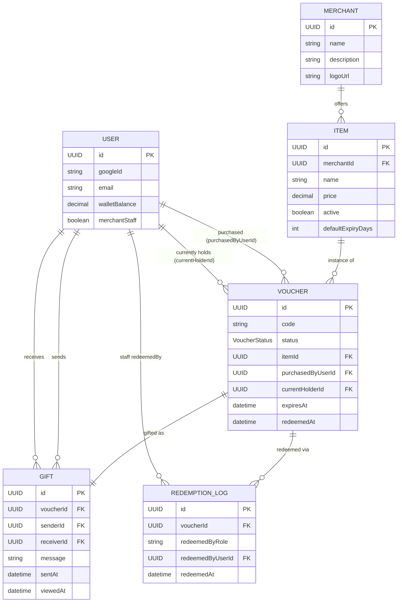
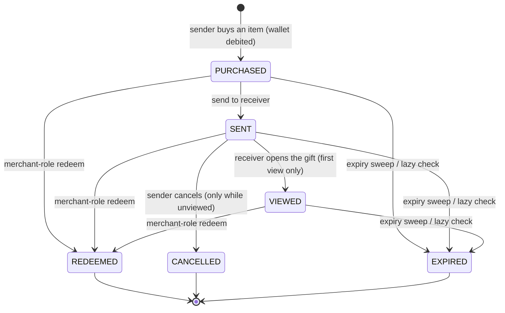
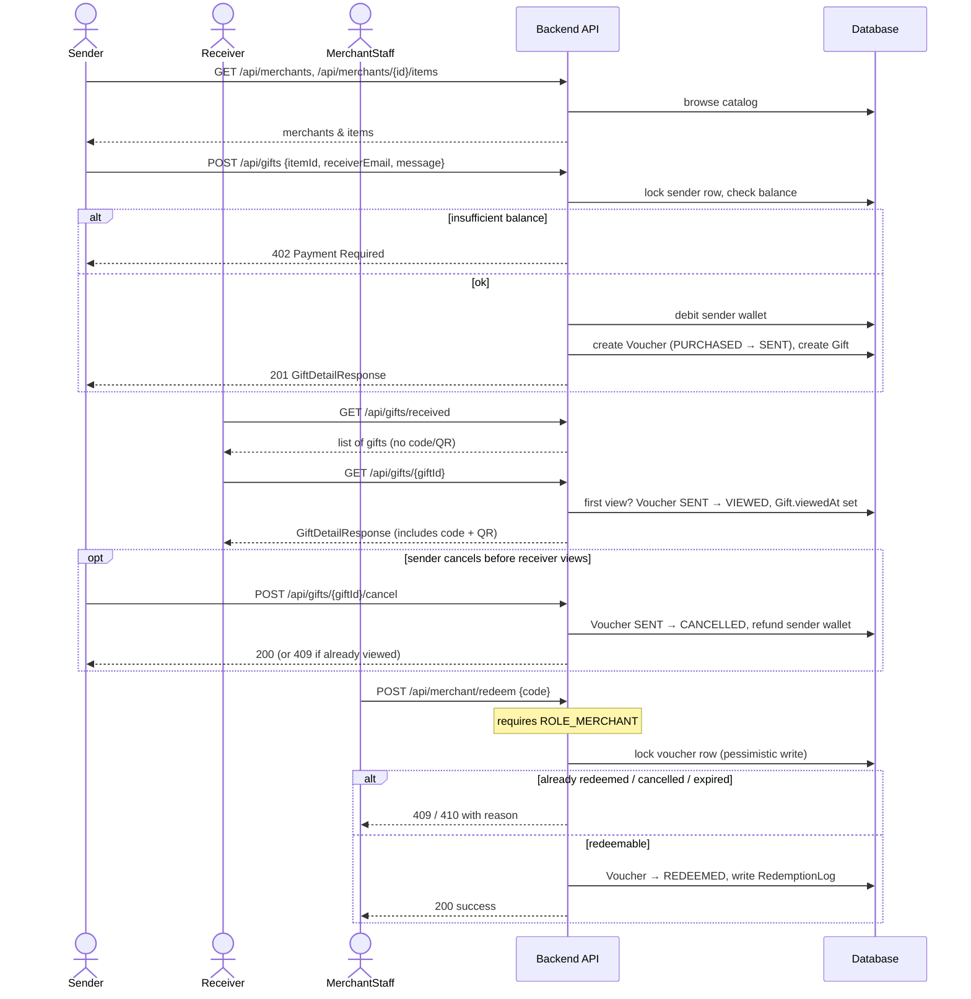

# GiftMoji domain model & flow

This document describes the backend domain model and the send → receive →
redeem gifting flow as implemented (see `feature/flyway-schema-migrations`,
`feature/gift-voucher-domain-model`, `feature/gifting-redemption-flow`, and
`feature/backend-domain-tests`). For the original product requirements this
implements, see [`CLAUDE.md`](../CLAUDE.md).

## Domain model

**Notes on the model:**
- `User` has no password — it's Google-OAuth-only, upserted on login. It
  carries a mocked wallet (`walletBalance`, seeded at `$50` on creation —
  there's no real payment gateway in this MVP) and a `merchantStaff` flag
  used for the redeem-screen authorization (see below).
- `Voucher.currentHolderId` starts equal to `purchasedByUserId` and moves to
  the receiver once the gift is sent — it's who's "holding" the voucher
  right now, independent of who paid for it.
- `Gift` is the join between a `Voucher` and the sender/receiver pair. A
  voucher has at most one gift (the send happens once, atomically, with the
  voucher).
- `RedemptionLog` is an audit trail, written once per successful redemption
  by `RedemptionService` — never mutated afterwards.

## Voucher lifecycle

Redemption is allowed from `PURCHASED`, `SENT`, or `VIEWED` — a merchant
doesn't require the receiver to have opened the gift first. Cancellation is
narrower: only from `SENT` and only before `Gift.viewedAt` is set, so a gift
can't be pulled back once the receiver has seen it (spec §4.4).

Expiry is enforced two ways: a `@Scheduled` sweep (`VoucherExpirySweepService`,
every 15 minutes) bulk-transitions overdue vouchers for list-accuracy, and
`VoucherService.redeem()` independently re-checks `expiresAt` at redemption
time regardless of stored status — the sweep is a UX nicety, not the actual
security boundary.

## End-to-end flow

## API surface

| Method | Path | Auth | Purpose |
|---|---|---|---|
| `GET` | `/api/merchants` | authenticated | list merchants |
| `GET` | `/api/merchants/{id}/items` | authenticated | list a merchant's active items |
| `GET` | `/api/items/{id}` | authenticated | fetch one active item |
| `POST` | `/api/gifts` | authenticated | buy an item and send it to a receiver by email |
| `GET` | `/api/gifts/received` | authenticated | gifts sent to me |
| `GET` | `/api/gifts/sent` | authenticated | gifts I sent |
| `GET` | `/api/gifts/{id}` | authenticated, sender or receiver only | gift detail (marks first view) |
| `GET` | `/api/gifts/{id}/qr` | authenticated, sender or receiver only | voucher QR as PNG |
| `POST` | `/api/gifts/{id}/cancel` | authenticated, sender only | cancel before the receiver views it |
| `POST` | `/api/merchant/redeem` | authenticated + `ROLE_MERCHANT` | redeem a voucher by code |
| `GET` | `/api/auth/me` | public (401 if not logged in) | current user |

`ROLE_MERCHANT` is granted via a config-driven email allowlist
(`giftmoji.merchant-emails`) checked on every login — there's no admin UI
yet to manage staff accounts, so this is the deliberately simple MVP
mechanism (see `GiftMojiOidcUserService`).

## Redemption atomicity

Two concurrent redeem requests for the same code must not both succeed.
`VoucherRepository.findByCodeForRedemption` takes a `PESSIMISTIC_WRITE` lock
inside `VoucherService.redeem()`'s transaction, so the second request blocks
until the first commits and then sees the already-`REDEEMED` status. This is
covered by a concurrency test (`RedemptionServiceTest`) that fires 10
simultaneous redemptions at one voucher and asserts exactly one `Success`
and exactly one `RedemptionLog` row.
